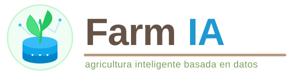
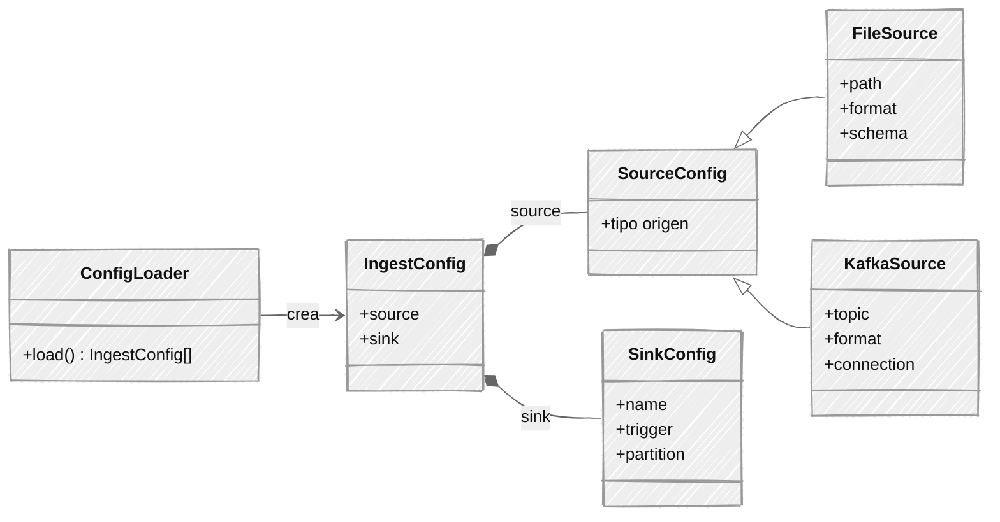
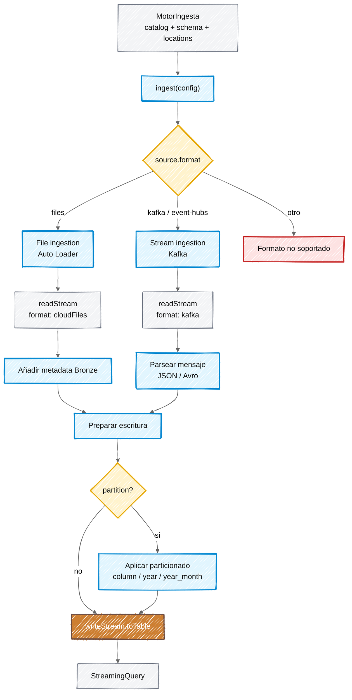
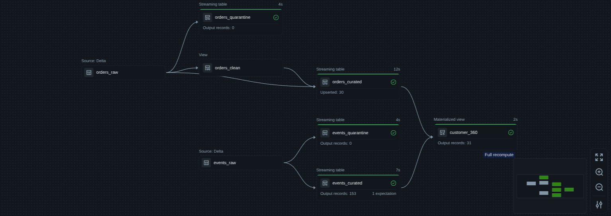
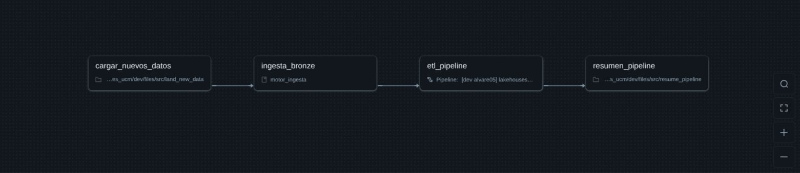

<div class="cover">
  
  <div class="cover-title">
    TAREA<br />
    DISEÑO DE INGESTAS<br />
    Y LAGOS DE DATOS
  </div>
  <div class="cover-footer">
    <div><strong>Autor:</strong> Alejandro de Cora</div>
    <div>Actualizado: 02-09-2026</div>
  </div>
</div>

<div class="notas">

# Notas <!-- omit in toc -->

- El código completo del trabajo se encuentra alojado en el repositorio: [https://github.com/adecora/bbdd-nosql](https://github.com/adecora/bbdd-nosql).
- Fuentes utilizadas:
  - El material de la asignatura **Diseño de ingestas y data lakehouses**.
  - [Documentación de **Azure Databricks**](https://learn.microsoft.com/en-us/azure/databricks/).
  - [**Databricks Learning Library**](https://www.databricks.com/training/catalog?itm_source=www&itm_category=learn&itm_page=home&itm_location=body&itm_component=hero&itm_offer=catalog&types=labs&roles=data-engineer).
  - [**Tutorial de Pydantic**](https://www.youtube.com/watch?v=M81pfi64eeM&t=40s&pp=ygUIcHlkYW50aWM%3D).
  - Modelos de lenguaje consultados:
    - Gemini Pro Latest
    - Gemini Flash Latest

</div>

# Índice <!-- omit in toc -->

<div class="toc">

- [Parte 1: Diseño de la arquitectura del Data Lakehouse](#parte-1-diseño-de-la-arquitectura-del-data-lakehouse)
  - [Revisión inicial](#revisión-inicial)
  - [Arquitectura lakehouse](#arquitectura-lakehouse)
- [Parte 2: Implementación del motor de ingesta](#parte-2-implementación-del-motor-de-ingesta)
  - [Paquete python: "motor\_ingesta"](#paquete-python-motor_ingesta)
  - [Pipeline: "lakehouses\_ucm\_etl"](#pipeline-lakehouses_ucm_etl)
  - [Job: "lakehouses\_ucm"](#job-lakehouses_ucm)
  - [Evidencias de ejecución](#evidencias-de-ejecución)
- [Referencias y Bibliografía](#referencias-y-bibliografía)

</div>

<div class="page-break"></div>



## Parte 1: Diseño de la arquitectura del Data Lakehouse

### Revisión inicial

Antes de realizar el diseño de la arquitectura, se lleva a cabo un estudio previo de las fuentes de datos de **FarmIA**. Para ello, se parte de las fuentes mencionadas en la tarea y de los [datasets sintéticos generados en el repositorio de la asignatura](https://github.com/jcenteno-ucm/lakehouses/blob/main/notebooks/06.farmia/00_farmia_datasets.py).


| Fuente de Datos | Descripción | Tipo de Dato | Herramienta / Origen de Ingesta en Azure | Tipo de Ingesta |
| :--- | :--- | :--- | :--- | :--- |
| **Sensores IoT** | Telemetría IoT de los campos (temperatura, humedad, pH). | Semi-estructurado (JSON) | *Azure IoT Hub* -> **Azure Event Hubs** | **Streaming**<br>*(Structured Streaming)* |
| **Eventos de clientes** | Clics, navegación web, uso de app móvil y redes sociales. | Semi-estructurado (JSON) | *API App* -> **Azure Event Hubs** | **Streaming**<br>*(Structured Streaming)* |
| **Ventas online** | Base de datos de la plataforma e-commerce transaccional. | Estructurado (Log de eventos CDC) | *Herramienta CDC (ej. Debezium)* -> **Azure Event Hubs** | **Streaming**<br>*(Structured Streaming)* |
| **Inventario local** |  Foto estática del stock en los almacenes (Snapshot). | Estructurado (Parquet / CSV) | *Exportación* -> **Azure Data Lake Storage Gen2 (ADLS)** | **Batch incremental**<br>*(Auto Loader)* |
| **Catálogo ERP (Productos)** | Maestro de dimensiones de productos, proveedores y precios. | Estructurado (Parquet / CSV) | *Exportación ERP* -> **Azure Data Lake Storage Gen2 (ADLS)** | **Batch incremental**<br>*(Auto Loader)* |
| **Meteorología** | Información meteorológica de una API externa. (ej. OpenWeather). | Semi-estructurado (JSON) | *Script Python consumiendo la API REST* -> **Azure Data Lake Storage Gen2 (ADLS)**. | **Batch programado**<br>*(Auto Loader)* |


<div class="page-break"></div>


### Arquitectura lakehouse

```mermaid
---
config:
  look: handDrawn
  theme: neutral
---
%% Ver: https://stackoverflow.com/a/76229461/32697703
%%{init: {'theme':'base', 'themeVariables': {'fontFamily':'Merienda', 'fontSize':'20px'}, 'flowchart': {'markdownAutoWrap': false, 'htmlLabels': true, 'subGraphTitleMargin': {'bottom':50, 'top':30}}}}%%
flowchart LR
    %% Definición de Estilos
    classDef sources fill:#f9f9f9,stroke:#333,stroke-width:2px;
    classDef azure fill:#e1f5fe,stroke:#0288d1,stroke-width:2px,color:#000;

    %% Capas arquitectura medallion
    classDef bronze fill:#cd7f32,stroke:#333,stroke-width:2px,color:#fff;
    classDef silver fill:#c0c0c0,stroke:#333,stroke-width:2px,color:#000;
    classDef gold fill:#ffd700,stroke:#333,stroke-width:2px,color:#000;

    classDef consume fill:#f0fdf4,stroke:#16a34a,stroke-width:2px,color:#000
    classDef databricks fill:#FF3621,stroke:#333,stroke-width:2px,color:#000;
    classDef hidden fill:transparent,stroke:transparent,color:transparent;

    %% Fuentes de datos
    subgraph Fuentes["`**Fuentes de Datos**`"]
        direction TB
        SENSORS((Sensores IoT)):::sources
        APP_EVENTS@{ shape: cloud, label: "Eventos de clientes en tiempo real"}
        ORDERS[("`Ventas online<br>**RDBMS**`")]:::source
        INVENTORY[("`Registros de inventario<br>**ERP**`")]:::source
        PRODUCTS[("`Catálogo y Proveedores<br>**ERP**`")]:::source
        WEATHER[API REST Externa]:::source
    end

    %% Ingesta
    subgraph Ingesta ["`**Landing Zone**`"]
        direction TB
        ADLS@{ img: "https://www.azure.cn/Images/marketing-resource/css/storage-date-lake-storage.svg", label: "ADLS Gen 2\nData Lake", pos: "t", h: 80, constraint: "on" }
        EH@{ img: "https://az-icons.com/images/event-hubs/icon.svg", label: "Event Hubs", pos: "t", h: 80, constraint: "on" }

        style EH fill:none, stroke:none;
        style ADLS fill:none, stroke:none;
    end

    %% Conexiones Fuentes -> Ingesta
    SENSORS fi1@==> EH
    APP_EVENTS fi2@==> EH
    ORDERS fi3@==> EH
    INVENTORY --> ADLS
    PRODUCTS --> ADLS
    WEATHER --> ADLS
    fi1@{ animate: true }
    fi2@{ animate: true }
    fi3@{ animate: true }

    %% Lakehouse
    subgraph Databricks ["`**Lakehouse**`"]
        direction LR

        %% Bronze
        subgraph Bronze ["`**Bronze<br>External tables**`"]
            direction TB
            %% B_GAP[" "]:::hidden
            B_SENSORS["sensor_raw"]:::bronze
            B_EVENTS["events_raw"]:::bronze
            B_ORDERS["orders_raw"]:::bronze
            B_INVENTORY["inventory_raw"]:::bronze
            B_PRODUCTS["products_raw"]:::bronze
            B_WEATHER["weather_raw"]:::bronze
        end

        %% Silver
        subgraph Silver ["`**Silver<br>Managed tables**`"]
            direction TB
            %% S_GAP[" "]:::hidden
            S_SENSORS["sensor_curated"]:::silver
            S_EVENTS["events_curated"]:::silver
            S_ORDERS["orders_curated"]:::silver
            S_INVENTORY["inventory_curated"]:::silver
            S_PRODUCTS["products_curated"]:::silver
            S_WEATHER["weather_curated"]:::silver
        end

        %% Gold
        subgraph Gold ["`**Gold<br>Managed tables**`"]
            direction TB
            %% G_GAP[" "]:::hidden
            G_CUSTOMER_360["customer_360"]:::gold
            G_FIELD_CONDITIONS["field_conditions"]:::gold
            G_SALES_SUMMARY["daily_sales_summary"]:::gold
            G_CURRENT_STOCK["current_stock"]:::gold
        end

        %% Conexiones Ingesta -> Bronze
        EH ib1@==> B_SENSORS
        EH ib2@==> B_EVENTS
        EH ib3@==> B_ORDERS
        ADLS --> B_INVENTORY
        ADLS --> B_PRODUCTS
        ADLS --> B_WEATHER
        ib1@{ animate: true }
        ib2@{ animate: true }
        ib3@{ animate: true }

        %% Conexiones Bonze -> Silver
        B_SENSORS bs1@==> S_SENSORS
        B_EVENTS bs2@==> S_EVENTS
        B_ORDERS bs3@==> S_ORDERS
        B_INVENTORY bs4@==> S_INVENTORY
        B_PRODUCTS bs5@==> S_PRODUCTS
        B_WEATHER bs6@==> S_WEATHER
        bs1@{ animate: true }
        bs2@{ animate: true }
        bs3@{ animate: true }
        bs4@{ animate: true }
        bs5@{ animate: true }
        bs6@{ animate: true }

        %% Conexiones Silver -> Gold
        S_SENSORS sg1@==> G_FIELD_CONDITIONS
        S_WEATHER sg2@==> G_FIELD_CONDITIONS
        S_ORDERS sg3@==> G_SALES_SUMMARY
        S_ORDERS sg4@==> G_CUSTOMER_360
        S_EVENTS sg5@==> G_CUSTOMER_360
        S_INVENTORY sg6@==> G_CURRENT_STOCK
        S_PRODUCTS sg7@==> G_CURRENT_STOCK
        sg1@{ animate: true }
        sg2@{ animate: true }
        sg3@{ animate: true }
        sg4@{ animate: true }
        sg5@{ animate: true }
        sg6@{ animate: true }
        sg7@{ animate: true }
    end

    %% Consumo
    subgraph Consumo ["`**Consumo**`"]
        direction TB
        POWER_BI[Power BI / Dashboards]:::consume
        ML_FLOW[MLflow / Data Science]:::consume
    end

    %% Conexiones consumo
    G_CUSTOMER_360 gc1@==> POWER_BI
    G_FIELD_CONDITIONS gc2@==> POWER_BI
    G_SALES_SUMMARY gc3@==> POWER_BI
    G_CURRENT_STOCK gc4@==> POWER_BI
    Silver ==> ML_FLOW
    gc1@{ animate: true }
    gc2@{ animate: true }
    gc3@{ animate: true }
    gc4@{ animate: true }


    class Databricks databricks
```

#### Bronze

| Fuente de Datos | Estrategia Bronze (External Table) |
| :--- | :--- |
| **Sensores IoT** | **sensor_raw**<br>Particionada por `ingest_month` |
| **Eventos de clientes** | **events_raw**<br>Particionada por `ingest_month` |
| **Ventas online** | **orders_raw**<br>Particionada por `ingest_month` |
| **Inventario local** | **inventory_raw**<br>Particionada por `ingest_month` |
| **Catálogo ERP (Productos)** | **products_raw**<br>Sin particionar *(Bajo volumen)* |
| **Meteorología** | **weather_raw**<br>Sin particionar *(Bajo volumen)* |

Se mantiene el control físico y seguro de los datos crudos creando las tablas como `External Location` en **Azure Data Lake Storage Gen2 (ADLS)**. La estrategia de particionar las tablas de alto volumen por mes[[1]](#ref1) permite configurar políticas automáticas de Azure (Storage Lifecycle Management)[[2]](#ref2). Esto facilita la migración transparente de datos históricos hacia almacenamientos en frío (ej. *Cold Tier* o *Archive Tier*[[3]](#ref3)), reduciendo drásticamente los costes de infraestructura.

#### Silver

| Tabla Origen (Bronze) | Tabla Destino (Silver - Managed Table) | Data Quality Expectations | Liquid Clustering |
| :--- | :--- | :--- | :--- |
| **sensor_raw** | **sensor_curated** | Valores anómalos (ej. temperatura) &rarr; **Desvío a Cuarentena** | `customer_id`, `event_ts` |
| **events_raw** | **events_curated** |Identificadores obligatorios nulos &rarr; **Desvío a Cuarentena** | `customer_id`, `event_ts` |
| **orders_raw** | **orders_curated** *(UPSERT / SCD1)* | Falta de valores esperados en un pedido --> **tabla cuarentena** | | |
| **inventory_raw** | **inventory_curated** | | |
| **products_raw** | **products_curated** *(SCD Tipo 2)*| | |
| **weather_raw** | **weather_curated** | | `field_id`, `forecast_ts` |

A partir de la capa Silver, las tablas se convierten en **Tablas Gestionadas (Managed Tables)** cediendo el control físico a Unity Catalog. Esto permite aprovechar al máximo las optimizaciones automáticas de rendimiento y mantenimiento de Databricks[[4]](#ref4), como la compactación de archivos y el borrado de históricos.

#### Gold

En la última capa de la arquitectura, se construyen vistas agregadas orientadas a dominios específicos para aportar valor directo al negocio (finanzas, logística y agricultura). Estas se implementan haciendo uso de `MATERIALIZED VIEWS`[[5]](#ref5), garantizando latencias mínimas para las herramientas de BI como Power BI.


<div class="page-break"></div>


## Parte 2: Implementación del motor de ingesta

Para desarrollar el motor de ingesta se hace uso de los Declarative Automation Bundles (DABs)[[6]](#ref6), una herramienta de Databricks que permite definir, gestionar y desplegar de forma automatizada proyectos completos de datos. Esto facilita la adopción de las mejores prácticas de ingeniería de software, como el control de versiones, el empaquetado de código y la integración/despliegue continuos (CI/CD).

El comando `databricks bundle init` genera una plantilla base con la estructura base que va a usar el proyecto:


```text
my_project/
├── databricks.yml                   # Definición y configuración global del DAB
├── pyproject.toml                   # Configuración del proyecto Python y sus dependencias
├── resources/                       # Definiciones de los recursos desplegados por el bundle
│   ├── sample_job.job.yml           # Definición de un Databricks Job
│   └── my_project_etl.pipeline.yml  # Definición del pipeline ETL
├── src/
│   ├── sample_notebook.ipynb        # Notebook de ejemplo
│   ├── my_project/                  # Paquete Python del proyecto
│   └── my_project_etl/              # Código fuente del pipeline ETL
│       └── transformations/         # Lógica de transformación del pipeline
├── tests/                           # Tests automatizados del proyecto
└── README.md                        # Documentación del proyecto
```


<div class="page-break"></div>


### Paquete python: "motor_ingesta"

El paquete se organiza de forma modular en dos grandes bloques: un submódulo config, responsable de la definición y validación del esquema de ingesta, y la clase principal MotorIngesta, encargada de orquestar la lectura y escritura hacia la capa Bronze.

#### Modelo de configuración (`config/templates.py` y `config/loader.py`)



- `ConfigLoader` procesa el fichero JSON de configuración, convirtiéndolo en una lista de objetos `IngestConfig`. Este paso actúa como un contrato de datos, ya que utiliza Pydantic para validar estrictamente cada entrada (rechazando campos anómalos o combinaciones incompatibles, como el uso simultáneo de schema y schemaHints).

- Cada `IngestConfig` modela un flujo completo uniendo un origen (source: sistema de ficheros, Kafka o Event Hubs) con un destino (sink: tabla de la capa Bronze, definiendo políticas de particionado y triggers de ejecución).

#### Flujo de ingesta (`motor_ingesta.py` y `main.py`)



- Durante su instanciación, `MotorIngesta` configura el contexto de ejecución de Unity Catalog (USE CATALOG / USE SCHEMA) y resuelve dinámicamente las rutas de almacenamiento para esquemas y checkpoints.

- El método `ingest()` itera sobre la configuración y, según source.format, delega el procesamiento en métodos privados (`__file_ingestion` mediante Auto Loader/cloudFiles, o `__stream_ingestion` para Kafka/Event Hubs). En ambos casos se enriquecen los registros con metadatos de linaje (como _ingested_at y metadatos de origen).

- El método de escritura (`__write_stream`) aplica las lógicas de particionado y configuración de micro-batches (triggers como availableNow o processingTime) para volcar los datos en las tablas Bronze. Retorna un objeto StreamingQuery por fuente.

- El archivo `main.py` actúa como el punto de entrada (entry point) CLI de la aplicación[[7]](#ref7), esperando en paralelo la resolución de todas las queries mediante un `ThreadPoolExecutor`.

### Pipeline: "lakehouses_ucm_etl"



Se declara en [`./resources/pipeline/lakehouses_ucm.pipeline.yml`](./resources/pipeline/lakehouses_ucm.pipeline.yml). El pipeline implementa la evolución de los datos hacia las capas Silver y Gold.

Crea la ingesta en **Silver** y **Gold** utilizando *Spark Declarative Pipelines (SDP)*, las transformaciones se definen en: [`./src/lakehouses_ucm_etl/transformations/`](./src/lakehouses_ucm_etl/transformations/).

- **Calidad de datos (Capa Silver):** Se implementan data quality expectations. Los registros que violan las reglas de negocio son capturados por instrucciones como `expect_or_drop` o `expect_all_or_drop` y son desviados hacia tablas de cuarentena, asegurando la integridad de las tablas curadas mientras se retienen los datos anómalos para su auditoría.

- **Change Data Capture (CDC):** La tabla orders_raw captura el log de transacciones. Mediante la función `create_auto_cdc_flow` aplica un patrón Slowly Changing Dimension (SCD) Tipo 2. Esto asegura el versionado histórico de los pedidos, utilizando la columna sequence_num para garantizar la correcta secuenciación de los eventos.

- **Capa Semántica (Capa Gold):** La tabla customer_360 se despliega como una Vista Materializada (Materialized View). El motor de Databricks computa y persiste físicamente las agregaciones de pedidos y eventos, y es capaz de realizar actulizaciones incrementales, que afectan únicamente a los datos subyacentes modificados en lugar de reprocesar todo el dataset.

### Job: "lakehouses_ucm"



Se declara en [`./resources/job/lakehouses_ucm.job.yml`](./resources/job/lakehouses_ucm.job.yml).

El orquestador define un grafo de dependencias (DAG) compuesto por cuatro tareas secuenciales:

- **cargar_nuevos_datos:** Tarea inicial que ejecuta el notebook `land_new_data.ipynb` para simular o cargar nuevos ficheros en la zona de landing, usando `number_of_files` como parámetro.

- **ingesta_bronze:** i+Invoca el módulo Python `motor_ingesta` a través de su punto de entrada (main). Ejecuta la captura de datos hacia la capa Bronze basándose en la configuración de Unity Catalog y el JSON de ingesta.

- **etl_pipeline:** Tras la consolidación en Bronze, esta tarea lanza el pipeline DLT (lakehouses_ucm_etl) para procesar las reglas de negocio, calidad de datos y actualizaciones incrementales hacia las capas Silver y Gold.

- **resumen_pipeline:** Tarea final de cierre. Ejecuta un notebook de auditoría que recopila las métricas del pipeline y, en caso de éxito, dispara una notificación por correo electrónico.


### Evidencias de ejecución

A continuación se incluyen vídeos que muestran el funcionamiento del paquete de ingesta y del flujo completo de procesamiento y despliegue:

| Evidencia | Descripción | Vídeo |
|---|---|---|
| Motor de ingesta en streaming | Ejecución del motor de ingesta procesando datos en streaming. | [Ver vídeo](https://drive.google.com/file/d/1NR42JlWa-ydK15Db4b3euMYVvEbPBDZP/view?usp=drive_link) |
| Pipeline de ingesta | Ejecución completa del pipeline de procesamiento de datos. | [Ver vídeo](https://drive.google.com/file/d/1LGVSUlah1t4_5x3XspWqE5zz8pmXwTCm/view?usp=drive_link) |
| Tests en Visual Studio Code | Ejecución de los tests automatizados del proyecto desde Visual Studio Code. | [Ver vídeo](https://drive.google.com/file/d/1XO2gX5Lb9L11NgdUIz9dFsYHkESu7OZF/view?usp=drive_link) |
| GitHub Actions | Ejecución del flujo de integración y despliegue definido en GitHub Actions. | [Ver vídeo](https://drive.google.com/file/d/1VU7U_X1Q_QKdkebFbWmptiX4muos8LfE/view?usp=drive_link) |


<div class="page-break"></div>


## Referencias y Bibliografía

<div class="references">

<a id="ref1">[1]</a> [Administración del ciclo de vida de los blobs (Azure Storage).](https://learn.microsoft.com/en-us/azure/storage/blobs/lifecycle-management-overview)

<a id="ref2">[2]</a> El particionado por mes se establece bajo la premisa de cumplir con las [recomendaciones de Databricks de alcanzar al menos **1GB** por partición y más de **1TB** de tamaño total de tabla](https://learn.microsoft.com/en-us/azure/databricks/tables/partitions#minimum-size-recommendations).

<a id="ref3">[3]</a> [Niveles de acceso (Tiers) que ofrece Azure Blob Data.](https://learn.microsoft.com/en-us/azure/storage/blobs/access-tiers-overview)

<a id="ref4">[4]</a> [Tablas Gestionadas vs Externas en Unity Catalog (Managed vs External).](https://learn.microsoft.com/en-us/azure/databricks/data-governance/unity-catalog/managed-versus-external)

<a id="ref5">[5]</a> [Vistas Materializadas en Databricks: Actualizaciones incrementales para mantener eficiencia de cómputo.](https://learn.microsoft.com/en-us/azure/databricks/ldp/concepts/materialized-views)

<a id="ref6">[6]</a> Infraestructura como código: [Declarative Automation Bundles (DAB).](https://learn.microsoft.com/en-us/azure/databricks/dev-tools/bundles/)

<a id="ref7">[7]</a> Se mapea en la sección **project.scripts** del archivo [`pyproject.toml`](./pyproject.toml).

</div>